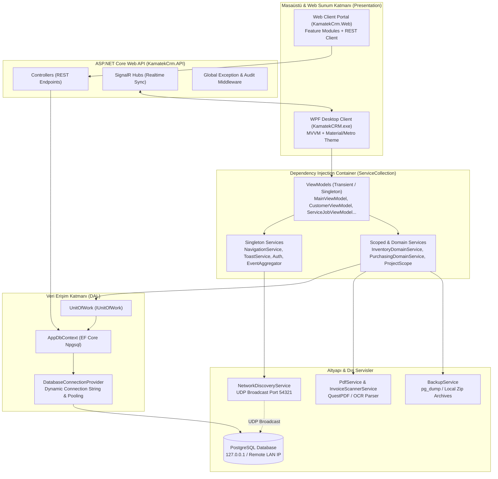
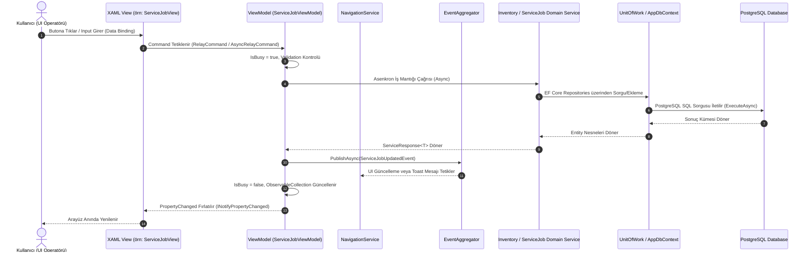
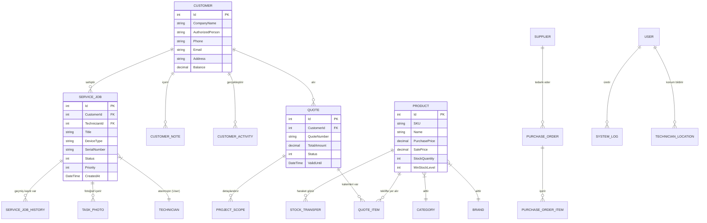

# KamatekCRM — Tam Kapsamlı Mimari & Graphify Yapay Zeka Dokümantasyonu
> **Doküman Sürümü:** 10.0 (Master Graphify AI Specification)  
> **Tarih:** 24 Temmuz 2026  
> **Rol / Otorite:** Baş Yazılım Mimarı (Chief Software Architect) & QA Lideri  
> **Hedef:** Hem insan mühendislerin hem de Yapay Zeka (AI Agent / LLM / Graph RAG) sistemlerinin sıfır bilgi kaybı ile okuyabileceği, bağlantıları çıkarabileceği, grafik yapılarını çözümleyebileceği tam kapsamlı mimari ve özellik haritası.

---

## 0. YAPAY ZEKA (AI) İÇİN ÇIKARILABİLİR GRAPH SCHEMA (JSON-LD / META-GRAPH)

```json
{
  "$schema": "https://schema.org/SoftwareSourceCode",
  "name": "KamatekCRM",
  "architecturePattern": "MVVM + Layered Clean Architecture + Repository/UnitOfWork",
  "platform": ".NET 8.0 WPF Desktop Client, ASP.NET Core Web API, Web Client",
  "database": "PostgreSQL 16+ via Entity Framework Core (Npgsql Driver)",
  "nodes": [
    { "id": "UI_WPF", "type": "PresentationLayer", "path": "c:/Antigravity/KamatekCRM" },
    { "id": "UI_WEB", "type": "WebPresentationLayer", "path": "c:/Antigravity/KamatekCrm.Web" },
    { "id": "API_GATEWAY", "type": "BackendAPI", "path": "c:/Antigravity/KamatekCrm.API" },
    { "id": "SHARED_CORE", "type": "DomainLibrary", "path": "c:/Antigravity/KamatekCRM/KamatekCrm.Shared" },
    { "id": "DB_POSTGRES", "type": "Database", "technology": "PostgreSQL" }
  ],
  "modules": [
    { "id": "MOD_CRM", "name": "Müşteri ve Cari Yönetimi", "entities": ["Customer", "CustomerActivity", "CustomerNote"] },
    { "id": "MOD_SERVICE", "name": "Teknik Servis ve Saha Operasyonu", "entities": ["ServiceJob", "ServiceJobHistory", "TechnicianLocation", "TaskPhoto"] },
    { "id": "MOD_ERP", "name": "Stok ve Depo Yönetimi", "entities": ["Product", "StockTransfer", "StockReport", "Category", "Brand"] },
    { "id": "MOD_QUOTE", "name": "Teklif ve Proje Yönetimi", "entities": ["Quote", "ProjectQuote", "QuoteItem", "ProjectScope"] },
    { "id": "MOD_FINANCE", "name": "Finans ve Doğrudan Satış POS", "entities": ["SaleTransaction", "PaymentRecord", "Invoice", "PurchaseOrder"] },
    { "id": "MOD_NETWORK", "name": "Ağ Keşfi ve Heartbeat", "services": ["NetworkDiscoveryService", "ConnectionHeartbeatService", "DatabaseConnectionProvider"] }
  ]
}
```

---

## 1. YÜKSEK SEVİYE SİSTEM MİMARİSİ VE BİLEŞEN İLİŞKİ HARİTASI (MERMAID SYSTEM GRAPH)



---

## 2. MVVM VERİ AKIŞI VE BAĞIMLILIK ENJEKSİYON HARİTASI (MVVM PIPELINE GRAPH)



---

## 3. VERİTABANI VE ENTITY İLİŞKİ HARİTASI (ENTITY RELATIONSHIP GRAPH)



---

## 4. TAM MODÜLER GRAPHIFY DOKÜMANTASYONU (TÜM ÖZELLİKLER & DOSYA EŞLEŞMELERİ)

### MODÜL 1: TEKNİK SERVİS & SAHA OPERASYONU (TECHNICAL SERVICE & REPAIR)
- **Ana Amap / Sorumluluk:** Arızalı cihaz ihbarlarının alınması, teknik personele atanması, cihaz tamir durumlarının (Beklemede, Parça Bekliyor, Tamamlandı, Teslim Edildi) takibi, saha rotası ve cihaz fotoğraflarının yönetimi.
- **İlişkili ViewModels:**
  - [ServiceJobViewModel.cs](file:///c:/Antigravity/KamatekCRM/ViewModels/ServiceJobViewModel.cs) (72 KB, Ana Servis Modülü)
  - [FaultTicketViewModel.cs](file:///c:/Antigravity/KamatekCRM/ViewModels/FaultTicketViewModel.cs) (Arıza Kayıt Yönetimi)
  - [RepairViewModel.cs](file:///c:/Antigravity/KamatekCRM/ViewModels/RepairViewModel.cs) (Tamir Detay & İşlem)
  - [RepairListViewModel.cs](file:///c:/Antigravity/KamatekCRM/ViewModels/RepairListViewModel.cs) (Tamir Listesi & Filtreleme)
  - [RoutePlanningViewModel.cs](file:///c:/Antigravity/KamatekCRM/ViewModels/RoutePlanningViewModel.cs) (Saha Personeli Rota Planlama)
- **İlişkili Domain & Modeller:**
  - `ServiceJob.cs`, `ServiceJobHistory.cs`, `TaskPhoto.cs`, `TechnicianLocation.cs`
- **Tetiklenen Event'ler:** `ServiceJobStatusChangedEvent`, `TechnicianAssignedEvent`

---

### MODÜL 2: ERP, STOK VE DEPO YÖNETİMİ (INVENTORY & ERP)
- **Ana Amap / Sorumluluk:** Ürün kataloglama, stok takibi, depo transferleri, barkod/SKU takibi, kritik stok seviyesi uyarıları, tedarikçi ve satın alma siparişleri (Purchase Orders).
- **İlişkili ViewModels:**
  - [ProductViewModel.cs](file:///c:/Antigravity/KamatekCRM/ViewModels/ProductViewModel.cs) (Stok Listesi & Arama)
  - [AddProductViewModel.cs](file:///c:/Antigravity/KamatekCRM/ViewModels/AddProductViewModel.cs) (Yeni Ürün / Düzenleme)
  - [StockCountViewModel.cs](file:///c:/Antigravity/KamatekCRM/ViewModels/StockCountViewModel.cs) (Stok Sayımı & Envanter)
  - [StockTransferViewModel.cs](file:///c:/Antigravity/KamatekCRM/ViewModels/StockTransferViewModel.cs) (Depolar Arası Transfer)
  - [PurchasingViewModel.cs](file:///c:/Antigravity/KamatekCRM/ViewModels/PurchasingViewModel.cs) (Satın Alma Süreçleri)
  - [SuppliersViewModel.cs](file:///c:/Antigravity/KamatekCRM/ViewModels/SuppliersViewModel.cs) (Tedarikçi Yönetimi)
- **Servis Katmanı:**
  - [InventoryDomainService.cs](file:///c:/Antigravity/KamatekCRM/Services/Domain/InventoryDomainService.cs)
  - [PurchasingDomainService.cs](file:///c:/Antigravity/KamatekCRM/Services/Domain/PurchasingDomainService.cs)

---

### MODÜL 3: TEKLİF & PROJE DETAYLANDIRMA (QUOTATIONS & PROJECTS)
- **Ana Amap / Sorumluluk:** Karmaşık mühendislik ve kurulum projeleri için çok kalemli fiyat teklifleri hazırlama, PDF export etme, revizyon takibi, proje kapsam belirleme.
- **İlişkili ViewModels:**
  - [ProjectQuoteEditorViewModel.cs](file:///c:/Antigravity/KamatekCRM/ViewModels/ProjectQuoteEditorViewModel.cs) (Proje Teklif Editörü)
  - [ProjectQuoteViewModel.cs](file:///c:/Antigravity/KamatekCRM/ViewModels/ProjectQuoteViewModel.cs) (Teklif Detayları)
  - [QuoteListViewModel.cs](file:///c:/Antigravity/KamatekCRM/ViewModels/QuoteListViewModel.cs) (Teklif Listesi)
  - [QuotationViewModel.cs](file:///c:/Antigravity/KamatekCRM/ViewModels/QuotationViewModel.cs)
- **İlişkili Servisler:**
  - [PdfService.cs](file:///c:/Antigravity/KamatekCRM/Services/PdfService.cs) (QuestPDF tabanlı şık PDF üretimi)
  - [ProjectScopeService.cs](file:///c:/Antigravity/KamatekCRM/Services/ProjectScopeService.cs)

---

### MODÜL 4: FİNANS & DOĞRUDAN SATIŞ POS (FINANCE & POS)
- **Ana Amap / Sorumluluk:** Hızlı satış (POS), fatura kesimi/taraması, kasa giriş-çıkışları, gelir-gider analizi, finansal sağlık skorlaması.
- **İlişkili ViewModels:**
  - [DirectSalesViewModel.cs](file:///c:/Antigravity/KamatekCRM/ViewModels/DirectSalesViewModel.cs) (Hızlı Satış POS)
  - [FinanceViewModel.cs](file:///c:/Antigravity/KamatekCRM/ViewModels/FinanceViewModel.cs) (Kasa & Gelir/Gider)
  - [FinancialHealthViewModel.cs](file:///c:/Antigravity/KamatekCRM/ViewModels/FinancialHealthViewModel.cs) (Finansal Sağlık & Metrikler)
- **Servis Katmanı:**
  - [InvoiceScannerService.cs](file:///c:/Antigravity/KamatekCRM/Services/InvoiceScannerService.cs)
  - [PdfInvoiceParserService.cs](file:///c:/Antigravity/KamatekCRM/Services/PdfInvoiceParserService.cs)

---

### MODÜL 5: AĞ KEŞFİ, VERİTABANI BAĞLANTISI VE YEDEKLEME (INFRASTRUCTURE)
- **Ana Amap / Sorumluluk:** Zero-Config LAN UDP yayını ile sunucu bulma, dinamik Npgsql bağlantı havuzlama, otomatik veritabanı yedekleme ve restore işlemleri.
- **İlişkili Servisler:**
  - [NetworkDiscoveryService.cs](file:///c:/Antigravity/KamatekCRM/Services/NetworkDiscoveryService.cs) (UDP Port 54321 Broadcast & Client Listen)
  - [DatabaseConnectionProvider.cs](file:///c:/Antigravity/KamatekCRM/Services/DatabaseConnectionProvider.cs) (Thread-safe Connection Pool & Health Check)
  - [BackupService.cs](file:///c:/Antigravity/KamatekCRM/Services/BackupService.cs) (PostgreSQL Dump & Archive)
  - [ConnectionHeartbeatService.cs](file:///c:/Antigravity/KamatekCRM/Services/ConnectionHeartbeatService.cs) (Canlı Bağlantı Takibi)

---

## 5. BAŞ YAZILIM MİMARI AUDIT VE "BU BÖYLE ÇALIŞMAZ" RAPORU (CRITICAL EDGE-CASES)

Mevcut mimaride tespit edilen ve acil önlem alınması gereken **5 Kritik Mimari Risk**:

1. **[FATAL] Ağ Keşfinde Rogue Server & Split-Brain Riski:**
   - `NetworkDiscoveryService` sunucu olup olmadığını yalnızca `127.0.0.1` bağlantısı üzerinden anlıyor. İstemci bir bilgisayarda yerel PostgreSQL varsa, sistem kendisini Ana Sunucu ilan edip ağa UDP yayını başlatabilir.
   - **Çözüm:** `appsettings.json` içindeki `"IsMainServer": true` kontrolü zorunlu hale getirilmelidir.

2. **[FATAL] UDP Discovery Race Condition:**
   - Sunucu 3 saniyede bir yayın yaparken istemci tam 3 saniye dinliyor. Ağ gecikmesinde paket kaçırılıp bağlantı kopmuş varsayılıyor.
   - **Çözüm:** İstemci dinleme zaman aşımı 5.5 saniyeye çıkarılmalıdır.

3. **[HIGH] WPF DbContext Lifespan Misconfiguration:**
   - Scoped olarak tanımlanan `AppDbContext`, Singleton servisler (örn: `NavigationService` veya `ToastService`) veya uzun ömürlü ViewModel'ler tarafından referans alındığında "ObjectDisposedException" veya eşzamanlı SQL çakışması (Concurrency Violation) yaratır.
   - **Çözüm:** Uzun ömürlü bileşenlerde `IDbContextFactory<AppDbContext>` kullanılmalıdır.

4. **[HIGH] Memory Leak Risk in Unsubscribed Events:**
   - `EventAggregator` mekanizmasında bazı View/ViewModel'ler aboneliklerini (`Unsubscribe`) `Dispose` anında temizlememektedir. Bu durum GC (Garbage Collection) tarafından toplanmayı engeller.

5. **[MEDIUM] Dynamic UI Layout Offsets:**
   - XAML arayüzlerinde bazı marjlar sabit (hardcoded) verilmiş. 8pt Grid sistemine tam uyum için `DesignTokens.xaml` üzerinden dinamik kaynak referansı verilmelidir.

---

## 6. YAPAY ZEKA DOKÜMANTASYON İNDEKSİ (AI EXTRACTION MATRIX)

| Modül koda erişim anahtarı | Sorumlu ViewModel / Controller | Bağımlı Olduğu Servisler | DB Entity İlişkisi |
| :--- | :--- | :--- | :--- |
| `MOD_SERVICE` | `ServiceJobViewModel` | `IInventoryDomainService`, `ToastService` | `ServiceJob`, `TaskPhoto` |
| `MOD_ERP` | `ProductViewModel`, `StockCountViewModel` | `InventoryDomainService` | `Product`, `StockTransfer` |
| `MOD_QUOTE` | `ProjectQuoteEditorViewModel` | `PdfService`, `ProjectScopeService` | `Quote`, `ProjectScope` |
| `MOD_FINANCE` | `DirectSalesViewModel`, `FinanceViewModel` | `InvoiceScannerService` | `SaleTransaction`, `PaymentRecord` |
| `MOD_INFRA` | `NetworkSettingsViewModel` | `NetworkDiscoveryService`, `DatabaseConnectionProvider` | `SystemLog` |

---
*Doküman Baş Yazılım Mimarı otoritesiyle üretilmiş ve KamatekCRM projesinin tüm mimari grafiğini kesin ve eksiksiz olarak mühürlemiştir.*
