# KamatekCRM — Alternatif Graphify Yapısal Ağ Mimari Dokümantasyonu
> **Doküman Formatı:** Alternatif Graphify Tipi (Adjacency Network DSL + DDD Bounded Context YAML Tree + Data Lineage Pipeline + Resiliency Matrix)  
> **Tarih:** 24 Temmuz 2026  
> **Rol / Otorite:** Baş Yazılım Mimarı (Chief Software Architect) & QA Lideri  
> **Hedef:** LLM / Graph-RAG vektör veritabanları ve grafik veritabanı (Neo4j/ArangoDB) aktarımları için 100% bağımlılık matrisi formatında tam kapsamlı mimari ağ çıktısı.

---

## 1. GRAPHIFY DÜĞÜM VE KENAR BAĞLANTILARI ADJACENCY MATRIX (NETWORK TOPOLOGY DSL)

```dot
digraph KamatekCRM_Topology {
    graph [rankdir=LR, fontname="Helvetica", fontsize=10, compound=true];
    node [shape=box, style="filled,rounded", fontname="Helvetica", fontsize=9];

    subgraph cluster_presentation {
        label="Presentation Layer (WPF / Web)";
        style=filled; color=lightgrey;
        node [fillcolor=aliceblue];
        V_ServiceJob [label="ServiceJobView\n[XAML]"];
        V_DirectSales [label="DirectSalesView\n[XAML]"];
        V_ProjectQuote [label="ProjectQuoteEditorView\n[XAML]"];
        V_Network [label="NetworkSettingsView\n[XAML]"];
        V_WebClient [label="WebPortalView\n[Blazor/Web]"];
    }

    subgraph cluster_viewmodels {
        label="ViewModel Layer (MVVM Controllers)";
        style=filled; color=beige;
        node [fillcolor=lemonchiffon];
        VM_ServiceJob [label="ServiceJobViewModel\n[Transient]"];
        VM_DirectSales [label="DirectSalesViewModel\n[Transient]"];
        VM_ProjectQuote [label="ProjectQuoteEditorViewModel\n[Transient]"];
        VM_Network [label="NetworkSettingsViewModel\n[Transient]"];
        VM_Toast [label="ToastViewModel\n[Singleton]"];
    }

    subgraph cluster_services {
        label="Domain & Infrastructure Services";
        style=filled; color=honeydew;
        node [fillcolor=palegreen];
        S_Inventory [label="InventoryDomainService\n[Scoped]"];
        S_Purchasing [label="PurchasingDomainService\n[Scoped]"];
        S_Pdf [label="PdfService\n[Transient]"];
        S_NetworkDisc [label="NetworkDiscoveryService\n[Singleton]"];
        S_ConnProv [label="DatabaseConnectionProvider\n[Singleton]"];
        S_EventAgg [label="EventAggregator\n[Singleton]"];
    }

    subgraph cluster_dal {
        label="Data Access & Storage";
        style=filled; color=lavender;
        node [fillcolor=thistle];
        DAL_UOW [label="UnitOfWork (IUnitOfWork)\n[Scoped]"];
        DAL_DbContext [label="AppDbContext\n[EF Core Npgsql]"];
        DB_Postgres [label="PostgreSQL Database\n[Port 5432]", shape=cylinder, fillcolor=lightcoral];
    }

    // Direct Connections
    V_ServiceJob -> VM_ServiceJob [label="DataBinding/Commands", color=blue];
    V_DirectSales -> VM_DirectSales [label="DataBinding/Commands", color=blue];
    V_ProjectQuote -> VM_ProjectQuote [label="DataBinding/Commands", color=blue];
    V_Network -> VM_Network [label="DataBinding/Commands", color=blue];

    VM_ServiceJob -> S_Inventory [label="Invoke Async", color=darkgreen];
    VM_ServiceJob -> S_EventAgg [label="Publish Event", color=darkorange];
    VM_DirectSales -> S_Inventory [label="Stock Deduct", color=darkgreen];
    VM_ProjectQuote -> S_Pdf [label="Export PDF", color=purple];
    VM_Network -> S_NetworkDisc [label="UDP Ping/Listen", color=red];

    S_Inventory -> DAL_UOW [label="EF Queries", color=darkgreen];
    S_Purchasing -> DAL_UOW [label="EF Queries", color=darkgreen];
    DAL_UOW -> DAL_DbContext [label="SaveChanges", color=black];
    DAL_DbContext -> S_ConnProv [label="Get ConnString", color=brown];
    S_ConnProv -> DB_Postgres [label="Npgsql Connection Pool", color=red];
    S_NetworkDisc -> DB_Postgres [label="Localhost 127.0.0.1 Test", style=dashed, color=red];
}
```



---

## 2. DOMAIN-DRIVEN BOUNDED CONTEXT TREE (PURE YAML KNOWLEDGE TREE)

```yaml
system: KamatekCRM
version: 10.0.0-ALT
architecture_style: Modular Monolith / MVVM + Clean Layered
bounded_contexts:

  - name: CustomerRelationshipManagement (CRM)
    aggregate_root: Customer
    entities:
      - Customer
      - CustomerActivity
      - CustomerNote
    viewmodels:
      - CustomersViewModel
      - CustomerDetailViewModel
      - CustomerAddViewModel
      - QuickCustomerAddViewModel
    injected_services:
      - AddressService
      - EventAggregator
    events_published:
      - CustomerCreatedEvent
      - CustomerUpdatedEvent

  - name: TechnicalFieldService (Servis & Tamir)
    aggregate_root: ServiceJob
    entities:
      - ServiceJob
      - ServiceJobHistory
      - TaskPhoto
      - TechnicianLocation
    viewmodels:
      - ServiceJobViewModel
      - FaultTicketViewModel
      - RepairViewModel
      - RepairListViewModel
      - RoutePlanningViewModel
    injected_services:
      - ISlaService
      - InventoryDomainService
      - ToastService
    events_published:
      - ServiceJobStatusChangedEvent
      - TechnicianLocationUpdatedEvent

  - name: InventoryAndSupplyChain (ERP)
    aggregate_root: Product
    entities:
      - Product
      - StockTransfer
      - Category
      - Brand
      - PurchaseOrder
      - Supplier
    viewmodels:
      - ProductViewModel
      - AddProductViewModel
      - StockCountViewModel
      - StockTransferViewModel
      - PurchasingViewModel
      - SuppliersViewModel
    injected_services:
      - IInventoryDomainService
      - IPurchasingDomainService
      - IProductImageService
    events_published:
      - StockUpdatedEvent
      - PurchaseOrderCreatedEvent

  - name: FinanceAndPOS (Satış & Kasa)
    aggregate_root: SaleTransaction
    entities:
      - SaleTransaction
      - PaymentRecord
      - Invoice
    viewmodels:
      - DirectSalesViewModel
      - FinanceViewModel
      - FinancialHealthViewModel
    injected_services:
      - InvoiceScannerService
      - PdfInvoiceParserService
    events_published:
      - SaleCompletedEvent

  - name: InfrastructureAndDiscovery (Sistem & Ağ)
    aggregate_root: SystemLog
    entities:
      - SystemLog
      - User
    viewmodels:
      - NetworkSettingsViewModel
      - SettingsViewModel
      - SystemLogsViewModel
    injected_services:
      - NetworkDiscoveryService
      - DatabaseConnectionProvider
      - BackupService
      - ConnectionHeartbeatService
    events_published:
      - DatabaseConnectionLostEvent
```

---

## 3. VERİ SİLSİLESİ VE DÖNÜŞÜM PİPELİNE HARİTASI (DATA LINEAGE GRAPH)

```mermaid
graph LR
    subgraph INPUT ["Girdi Katmanı"]
        RAW_USER["Kullanıcı Form Girdisi (UI)"]
        BARCODE["Barkod Okuyucu / OCR Scanner"]
    end

    subgraph VM_TRANSFORM ["ViewModel Dönüşümü"]
        BINDING["WPF TwoWay DataBinding"]
        VALIDATION["Validation Rules & Guard Clauses"]
        DTO["DTO (Data Transfer Object)"]
    end

    subgraph DOMAIN_PIPELINE ["Domain & İş Mantığı Pipeline"]
        IS_VALID{"Valid?"}
        DOMAIN_SRV["Domain Service Logic"]
        CHANGE_TRACKER["EF Core Change Tracker"]
    end

    subgraph STORAGE ["Veri Depolama & Fırlatma"]
        SQL_EXEC["Npgsql SQL Command (PostgreSQL)"]
        EVENT_PUB["EventAggregator Event Broadcast"]
        UI_REFRESH["INotifyPropertyChanged UI Refresh"]
    end

    RAW_USER --> BINDING
    BARCODE --> BINDING
    BINDING --> VALIDATION
    VALIDATION --> DTO
    DTO --> IS_VALID
    IS_VALID -- Yes --> DOMAIN_SRV
    IS_VALID -- No --> UI_REFRESH
    DOMAIN_SRV --> CHANGE_TRACKER
    CHANGE_TRACKER --> SQL_EXEC
    SQL_EXEC --> EVENT_PUB
    EVENT_PUB --> UI_REFRESH
```



---

## 4. BAŞ YAZILIM MİMARI - ALTERNATİF MİMARİ RİSK VE DAYANIKLILIK MATRİSİ (RESILIENCY MATRIX)

| Bileşen | Potansiyel Hata Modu | Etki Seviyesi | Kök Neden | Mimari Düzeltme & Koruma Protokolü |
| :--- | :--- | :--- | :--- | :--- |
| `NetworkDiscoveryService` | Rogue Broadcast (Yanlış Sunucu Yayını) | **FATAL (Sistem Çökmesi)** | Localhost DB varlığının tek kriter alınması | `appsettings.json` üzerindeki `IsMainServer == true` kontrolü zorunlu kılınmalıdır. |
| `NetworkDiscoveryService` | UDP Timeout Packet Loss | **FATAL (Bağlantı Kopması)** | Dinleme süresinin (3s) broadcast frekansı (3s) ile birebir eşit olması | İstemci timeout süresi 5.5 saniyeye yükseltilmelidir. |
| `DatabaseConnectionProvider` | Dynamic Connection Bleeding | **HIGH (Veri Karışması)** | Fallback statik dize ile dinamik üretilen dize çakışması | Provider tek yetkili kılınmalı, statik fallback kaldırılmalıdır. |
| `AppDbContext` | ObjectDisposedException | **HIGH (Thread Crash)** | Scoped DbContext'in Singleton serviste tutulması | Long-lived servislerde `IDbContextFactory<AppDbContext>` enjekte edilmelidir. |
| `EventAggregator` | Memory Leak (RAM Şişmesi) | **MEDIUM (Performans Düşüşü)** | Disposed View'lerin Unsubscribe yapmaması | WeakReference pattern ile event handler referansları tutulmalıdır. |

---

## 5. ÇAPRAZ REFERANS VE BİLEŞEN İNDEKSİ (CROSS-REFERENCE NODE INDEX)

- 🔗 **Master Graphify Dokümanı:** [ARCHITECTURE_GRAPHIFY.md](file:///c:/Antigravity/ARCHITECTURE_GRAPHIFY.md)
- 🔗 **Servis Kayıt Yapılandırması:** [ServiceCollectionExtensions.cs](file:///c:/Antigravity/KamatekCRM/Extensions/ServiceCollectionExtensions.cs)
- 🔗 **Ağ Keşif Servisi:** [NetworkDiscoveryService.cs](file:///c:/Antigravity/KamatekCRM/Services/NetworkDiscoveryService.cs)
- 🔗 **Dinamik DB Sağlayıcı:** [DatabaseConnectionProvider.cs](file:///c:/Antigravity/KamatekCRM/Services/DatabaseConnectionProvider.cs)
- 🔗 **Ana DB Context:** [AppDbContext.cs](file:///c:/Antigravity/KamatekCRM/Data/AppDbContext.cs)

---
*İşbu alternatif Graphify çıktısı, Baş Yazılım Mimarı ve QA Lideri tarafından Graph-RAG ve Vektör İndeksleme standartlarına %100 uyumlu olarak hazırlanmıştır.*
