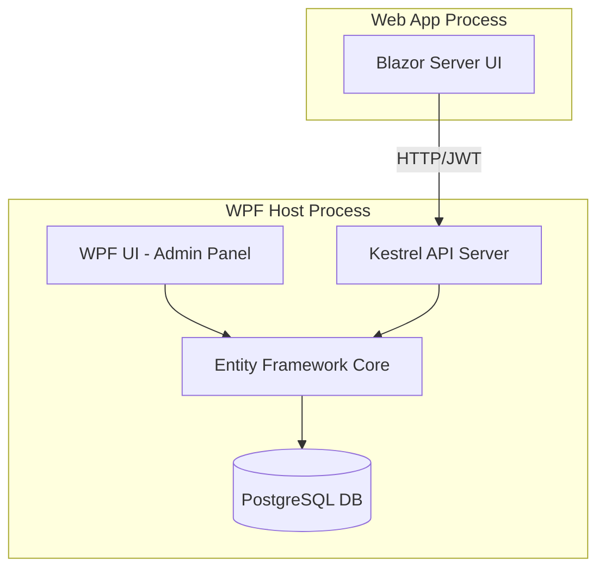

# KamatekCRM Architectural Guide

This document provides a deep dive into the architectural principles and patterns used in the KamatekCRM ecosystem.

## 1. Hybrid Architecture Overview

KamatekCRM utilizes a **Hybrid Architecture** where a desktop application (WPF) serves as the host for a distributed system, including a Web API and a Blazor Web App.

### Components
*   **Host (WPF Desktop App)**: Controls the lifecycle of the entire system.
*   **Backend (ASP.NET Core API)**: Self-hosted within the WPF process via Kestrel.
*   **Frontend (Blazor Server)**: A separate process launched and managed by the WPF Host.

---

## 2. Dependency Injection (DI)

The system follows a strict **Constructor Injection** pattern managed by `Microsoft.Extensions.DependencyInjection`.

### Service Registration
All services are registered in `ServiceCollectionExtensions.cs` using appropriate lifecycles:
*   **Singleton**: Services holding global state (e.g., `NavigationService`, `ToastService`).
*   **Scoped**: Database context and Unit of Work (`AppDbContext`, `IUnitOfWork`).
*   **Transient**: ViewModels and lightweight utilities.

---

## 3. CQRS with MediatR

To maintain a clean separation between commands (writes) and queries (reads), the system implements the **CQRS (Command Query Responsibility Segregation)** pattern using **MediatR**.

### Pattern Implementation
1.  **Commands**: Encapsulate actions that change state. Located in `Application/Features/[Module]/Commands`.
2.  **Queries**: Encapsulate requests for data. Located in `Application/Features/[Module]/Queries`.
3.  **Handlers**: Contain the actual business logic, ensuring that ViewModels/Controllers remain lean.

### Example Flow:
`ViewModel` --(Send Command)--> `MediatR` --(Route)--> `CommandHandler` --(Write)--> `Database`

---

## 4. Repository and Unit of Work

The data access layer is abstracted to ensure testability and transactional integrity.

*   **Repository**: Provides a collection-like interface for domain entities.
*   **Unit of Work**: Coordinates the work of multiple repositories by sharing a single `AppDbContext` and managing transactions.
*   **Specification Pattern**: Used within queries to build complex, reusable filters without leaking EF Core logic into the application layer.

---

## 5. View-Model-ViewModel (MVVM)

The WPF application adheres to the **MVVM** pattern using the **CommunityToolkit.Mvvm** library.
*   **ObservableProperty**: Handles `INotifyPropertyChanged` automatically.
*   **RelayCommand**: Binds UI actions to ViewModel logic without code-behind.
