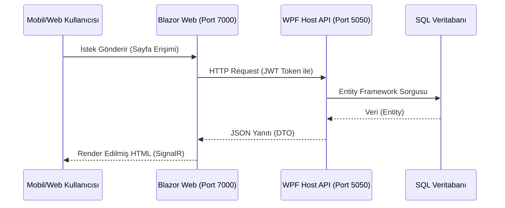

# Kamatek CRM - Web Modülü (Teknik Dokümantasyon)

Bu belge, KamatekCRM ekosistemine eklenen **Blazor Server** tabanlı Web Uygulamasının teknik yapısını, çalışma mantığını ve ana uygulama (WPF) ile olan ilişkisini detaylandırır.

---

## 1. Mimari Genel Bakış (Hybrid Architecture)

KamatekCRM artık **Hibrit** bir yapıya sahiptir. Masaüstü uygulaması (WPF), hem ana iş mantığını yürütür hem de arka planda gerekli sunucuları barındırır.

### Bileşenler ve Roller

1.  **Host (WPF Desktop App)**:
    *   **Rolü**: Orkestratör ve Ana Sunucu.
    *   **Görevi**: Uygulama açıldığında Entity Framework Core veritabanını yönetir, arka planda API sunucusunu başlatır (`Kestrel`) ve Web Uygulamasını (`ProcessManager` aracılığıyla) tetikler.
    *   **Port**: `0.0.0.0:5050` (API Sunucusu)

2.  **Backend (API Server - Self Hosted)**:
    *   **Teknoloji**: ASP.NET Core Web API (WPF içinde gömülü).
    *   **Görevi**: Veritabanı erişimi, kimlik doğrulama (JWT) ve iş mantığını dış dünyaya sunmak.
    *   **Erişim**: `http://localhost:5050` (Yerel) / `http://[IP]:5050` (Ağ)

3.  **Frontend (Web App)**:
    *   **Teknoloji**: ASP.NET Core Blazor Server (.NET 9).
    *   **UI Kütüphanesi**: MudBlazor (Material Design).
    *   **Görevi**: Teknisyenlerin sahadan verilere erişmesini sağlayan arayüz.
    *   **Erişim**: `http://localhost:7000` (Yerel) / `http://[IP]:7000` (Ağ)

---

## 2. İletişim ve Veri Akışı

Web Uygulaması, veritabanına doğrudan bağlanmaz. Tüm işlemler **API** üzerinden gerçekleşir.

### Kimlik Doğrulama (Authentication)
*   **Yöntem**: JWT (JSON Web Token).
*   **Akış**:
    1.  Kullanıcı Web Arayüzünden giriş yapar.
    2.  `AuthService`, API'nin `/api/auth/login` endpoint'ine istek atar.
    3.  API geçerli ise bir JWT Token döner.
    4.  Web App, bu token'ı `localStorage`'a kaydeder (`Blazored.LocalStorage`).
    5.  `CustomAuthenticationStateProvider`, token'ı okur, doğrular ve kullanıcının oturumunu açar.
    6.  Sonraki tüm API isteklerine bu Token `Authorization: Bearer <token>` başlığı ile eklenir.

---

## 3. Proje Yapısı (KamatekCrm.Web)

Web projesi, Modüler ve Temiz Mimari (Clean Architecture) prensiplerine sadık kalınarak yapılandırılmıştır.

*   **Components/**
    *   **Layout/**: `MainLayout.razor` (Ana şablon), `LoginLayout.razor` (Giriş sayfası şablonu), `NavMenu.razor`.
    *   **Pages/**:
        *   `Home.razor`: Dashboard özet ekranı.
        *   `Login.razor`: Giriş formu.
        *   `Tasks/`: Görev listesi ve detay sayfaları.
*   **Services/**
    *   `IClientAuthService` / `ClientAuthService`: Login/Logout işlemleri.
    *   `ITaskService` / `TaskService`: Görev yönetimi API çağrıları.
    *   `CustomAuthenticationStateProvider`: Blazor Auth state yönetimi.
*   **Program.cs**:
    *   Dependency Injection (DI) konfigürasyonu.
    *   MudBlazor servisi (`AddMudServices`).
    *   Port sabitleme (`UseUrls("http://0.0.0.0:7000")`).
    *   Exception Handling (`UseDeveloperExceptionPage`).

---

## 4. Uzaktan Erişim (Remote Access)

Sistemin "Her Yerden Erişim" özelliği şu konfigürasyonlarla sağlanır:

1.  **IP Binding (`0.0.0.0`)**:
    *   Geleneksel `localhost` yerine, sunucular tüm ağ arayüzlerini dinler. Bu sayede aynı ağdaki diğer cihazlar sunucuya erişebilir.
2.  **Firewall**:
    *   `Enable-RemoteAccess.ps1` scripti, Windows Güvenlik Duvarı'nda 5050 ve 7000 portlarını dışarıya açar.
3.  **Port Yönlendirme (Opsiyonel)**:
    *   Router üzerinden yapılan yönlendirme ile internet üzerinden erişim mümkündür (Bkz: `REMOTE_ACCESS_GUIDE.md`).

---

## 5. Geliştirici Notları

*   **Yeni Sayfa Ekleme**: `Pages` klasörüne yeni `.razor` dosyası ekleyin. `TaskService` benzeri bir servis yazarak API ile konuşturun.
*   **Tema**: MudBlazor teması `MainLayout.razor` içindeki `MudThemeProvider` ile yönetilir.
*   **Hata Ayıklama**: `UseDeveloperExceptionPage` aktif olduğu için tarayıcıda detaylı hatalar görülebilir.
*   **Performans**: Blazor Server, sunucu ile sürekli bir WebSocket (SignalR) bağlantısı tutar. Bağlantı koparsa arayüz "Reconnecting" moduna geçer.
